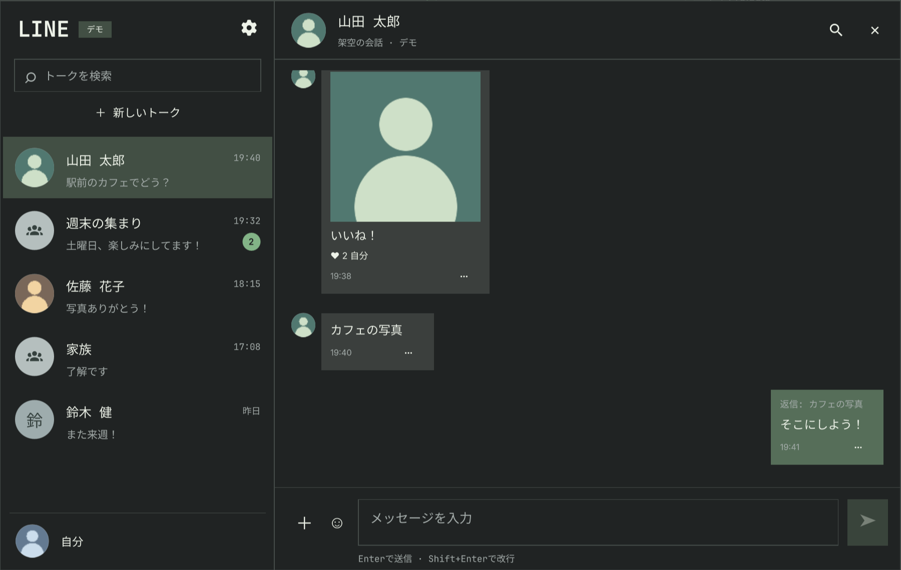

# LINE for Omarchy

Omarchy 4 QuattroでLINEのチャット・返信・添付・スタンプを使う、QMLとGoの開発中プラグインです。LINE公式の製品ではありません。

## インストール

必要なものを用意してから、次の1行を実行してください。

```bash
git clone https://github.com/komagata/line.git && cd line && ./scripts/setup
```

- Linux、Omarchy 4 Quattro / Quickshell、Qt Quick Controls・Dialogs
- ソースの取得・ビルド用: git、Go 1.26以降、Python 3
- 認証保存用: libsecretの `/usr/bin/secret-tool` とアンロック済みのSecret Service
- 通知を使う場合: `/usr/bin/notify-send`（Arch Linuxでは `libnotify`）

Arch Linuxのパッケージ名は `git`、`go`、`python`、`libsecret` です。setupはシステムパッケージをインストールしません。

setupは前提と配置先を確認し、固定されたGoモジュールをダウンロードしてビルドします。検証済みの配布物だけを `~/.config/omarchy/plugins/io.github.komagata.line` に配置し、再検出・有効化します。既存の配置先や同じIDのプラグインがあれば、ビルド前に停止します。シェルの再起動やログインは行いません。

ソース取得だけでは `bin/line-gui` が生成されないため、標準の `omarchy plugin add` では導入できません。実行時のダウンロード・ビルドはなく、Node、Python、qrencode、外部の `line` CLIも不要です。

## 使い方

バーのLINEアイコンから開き、設定で再読み込み・QRログインを行います。送信はEnter、改行はShift+Enterです。トークは最大500件、履歴は直近100件。会話と下書きはメモリ内に保持し、サービス終了で消えます。送信結果が不明な場合は自動再送しません。

ローカルのGo版では保存済みアカウントのトーク・アイコン・所有スタンプと受信接続を確認しています。実QRログインのやり直し、実送信・相手への配達は未検証です。



画像の名前・会話・アイコンは架空のものです。通常の画面にはデモへ切り替えるボタンはありません。

## 更新・削除

配置するのはビルド済みのコピーです。更新は取得した `line` ディレクトリで行います。標準のGit管理プラグイン向け更新操作は使いません。

```bash
git pull --ff-only
(cd backend && GOTOOLCHAIN=local go mod download)
./scripts/build
omarchy plugin disable io.github.komagata.line
./scripts/install "$HOME/.config/omarchy/plugins/io.github.komagata.line" --upgrade
omarchy-shell shell rescanPlugins
omarchy plugin enable io.github.komagata.line
```

旧版は検出対象外の `~/.config/omarchy/plugins-backups/` に残り、置き換えに失敗すれば元へ戻ります。戻す場合は無効化してから、インストーラーが出力したバックアップを指定します。

```bash
./scripts/install "$HOME/.config/omarchy/plugins/io.github.komagata.line" --rollback "$HOME/.config/omarchy/plugins-backups/io.github.komagata.line.backup-..."
omarchy-shell shell rescanPlugins
omarchy plugin enable io.github.komagata.line
```

setupが配置後の再検出・有効化で失敗した場合は、原因を直して上のrescan・enableを実行してください。再度setupを実行しても既存ファイルは置き換えません。

削除は次の操作です。認証情報と旧CLI、バックアップは残ります。バックアップの削除は内容確認後に手動で行ってください。

```bash
omarchy plugin disable io.github.komagata.line
omarchy plugin remove io.github.komagata.line
```

## 開発・出典

テストには追加で `qmltestrunner` / QtTestが必要です。モジュール取得後のビルド・テストはオフラインで実行し、Goキャッシュはソースの外に置きます。

```bash
export GOCACHE=/tmp/omarchy-line-gocache
./scripts/build
./tests/run
omarchy plugin validate build/plugin
```

開発時の画面確認には、架空データを使うデモIPCを残しています。ログインや実送信は行いません。デモを終了して通常の利用に戻る場合は、プラグインを無効化・有効化してサービスを起動し直してください。

```bash
omarchy-shell shell summon io.github.komagata.line '{"demo":true}'
```

`build/plugin/` にはQML、manifest、ライセンス・出典、静的リンクした `bin/line-gui` が入ります。ビルドは `CGO_ENABLED=0`、`-trimpath`、`-buildvcs=false` を使います。テストはGoのrace・vet・暗号テスト、QtTest、メッセージ描画のローカルHTTP検証を含みます。

[ソースと依存の出典](docs/go-source-provenance.txt)を参照してください。上流、生成コード・データ、Go標準ライブラリと実行時依存のライセンス文書を配布物のNOTICEに含めます。
